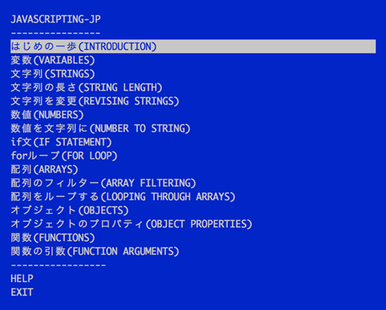

# JAVASCRIPTING-JP

これは[JAVASCRIPTING](https://github.com/sethvincent/javascripting)の日本語訳です。

## Node.jsをインストールします

Node.jsはインストールされていますか？されていなければ、

[nodejs.org/download](http://nodejs.org/download)
からインストールしてください。

### `npm`を使って、`javascripting-jp`をインストールします

ターミナルを開いて次のコマンドを実行します。

```
npm install --global javascripting-jp
```

`--global`オプションを使うと、このモジュールをグローバルにインストールします。
ターミナルでコマンドとして使えるようになります。

## ワークショップを実行します

ターミナルを開いて、次のコマンドを実行します...

```
javascripting-jp
```

メニューを表示します。



上下キーでメニューを操作できます。

エンターキーを押すと課題が選べます。

### 最初の課題のgif動画（未翻訳）


gif内で使っているコマンドラインエディタは `nano` ([here are some basic usage tips for nano](https://github.com/sethvincent/dev-envs-book/blob/master/chapters/05-editors.md#nano))です。

お好みのエディタを使ってください。

[atom](http://atom.io) や [brackets](http://brackets.io/) は良い選択肢です。

## 翻訳進捗

- [x] INTRODUCTION
- [x] VARIABLES
- [x] STRINGS
- [x] STRING LENGTH
- [x] REVISING STRINGS
- [x] NUMBERS
- [x] ROUNDING NUMBERS
- [ ] NUMBER TO STRING
- [ ] IF STATEMENT
- [ ] FOR LOOP
- [x] ARRAYS
- [x] ARRAY FILTERING
- [x] LOOPING THROUGH ARRAYS
- [x] OBJECTS
- [x] OBJECT PROPERTIES
- [x] FUNCTIONS
- [x] FUNCTION ARGUMENTS

## 翻訳ルール
- 「:」 は 「...」 を使って、続きがある感じを表現しています。
- codeの前後に半角スペースを一つあけています。
- 見出し2の「課題」は「やってみよう」と訳しています。
- 課題末尾の`Check to see if your program is correct by running this command:`は「次のコマンドを実行し、あなたのプログラムが正しく動くか確認しましょう。」で統一しています。

## 翻訳参加者

- [Taiju Muto](https://github.com/tai2)

## License

MIT
